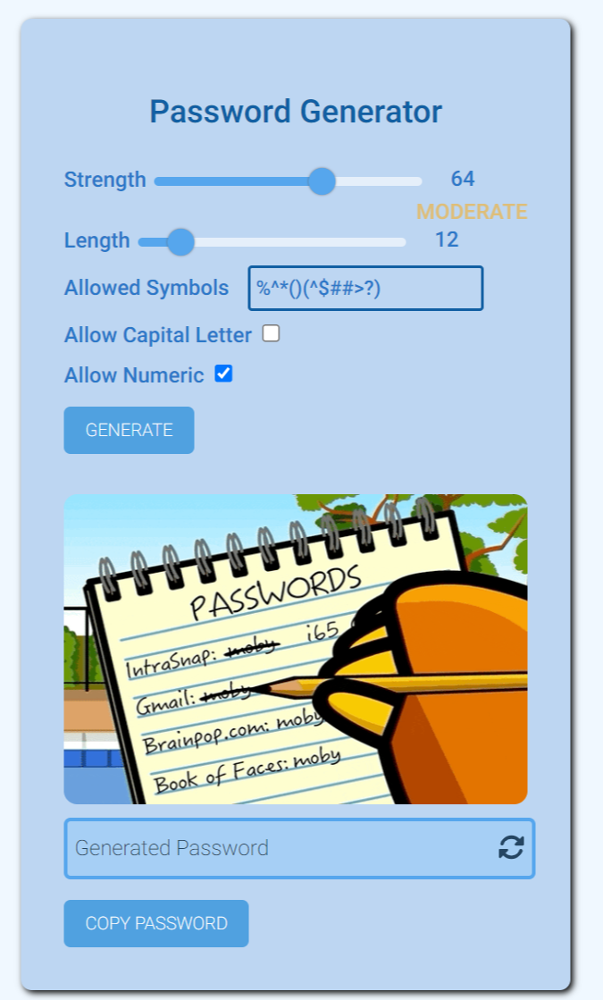

# password generator

## Table of contents

- [Overview](#overview)
  - [The challenge](#the-challenge)
  - [Screenshot](#screenshot)
  - [Links](#links)
  - [Built with](#built-with)
- [Author](#author)

**Note: Delete this note and update the table of contents based on what sections you keep.**

## Overview

### The challenge

Users should be able to:

- generate strong and unhackable password
- user can select the strength of the password they want.
- copy generated password to clipboard
- add symbols to form 
- select the length of the password you want to generate
- can choose to add numbers and capital letters to the password

### Screenshot

### Links

- Solution URL: [ solution URL](https://github.com/louis-bamidele/-project4-passwordGenerator/)
- Live Site URL: [live site URL](https://louis-bamidele.github.io/-project4-passwordGenerator/)

### Built with

- Semantic HTML5 markup
- CSS custom properties
- Flexbox
- javascript
- Mobile-first workflow

## about the project
- Passwords that are strong are unique and random.
- Humans aren’t very good at coming up with passwords that are either of those things, let alone both. Therefore, I have developed a Strong Password Generator that will generate secure and memorable passwords for you. 81% of data breaches are caused by reused or weak passwords, so random, unique passwords are your best defense against online threats.

- why should i use a password generator
- If you use the same password for both your email account and your bank account login, an attacker only needs to steal one password to get access to both accounts, doubling your exposure. If you've used that same password for 14 different accounts, you're making the attacker's job very, very easy. To protect yourself, you can make sure you create unique passwords that are easy to remember by using a password generator.

## Author

- Website - [louis](https://www.your-site.com)
- Twitter - [@yourusername](https://www.twitter.com/_louis_15)

